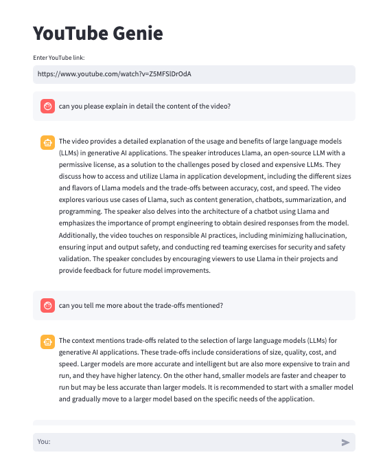

# YouTube Genie 🧞‍♂️

Ever found yourself stuck watching a 20-minute YouTube video just to see if it has the answers you seek? What if I told you there's a shortcut to enlightenment? Welcome to YouTube Genie, your swift portal to unraveling the mysteries of YouTube without the video marathon.


Here's a snippet of what the YouTube Genie looks like:




## Overview

Tired of the endless quest for knowledge hidden in lengthy videos? Fear not! YouTube Genie is here to grant your wishes, minus the waiting and video-watching ordeal. No need to rub lamps or consult mystical beings—just enter a YouTube link and fire away with your questions.

**How it works:**

1. **Skip the Video Odyssey:** No more endless scrolling through videos. Enter the link, and YouTube Genie will do the deciphering for you. 

2. **Ask Away:** Want to know who said what, when, or why? Type your questions into the magical chat, and let the Genie weave its data magic.

3. **Instant Insights:** In a flash, YouTube Genie summons its digital powers (courtesy of OpenAI) to provide you with instant responses. No more waiting; it's time to conquer the YouTube realm efficiently.

## Why YouTube Genie?

Why waste time watching entire videos when you can have a direct conversation with your digital guide? This project emerged from the desire to cut through the noise of lengthy content and get straight to the heart of your questions. Forget the 20-minute video, bring on the instant insights!

## How to Use

1. **Install the Magic:** Run the following command to set the enchantment in motion:

   ```bash
    pip install -r requirements.txt
    ```

2. **Get Your API Key:** Visit [OpenAI's platform](https://platform.openai.com/signup), create an account, and obtain your API key.

3. **Replace the Placeholder:** Open the `chat.py` file and replace the placeholder `"OPENAI_API_KEY"` on line 8 with your actual OpenAI API key.

   ```python
   openai.api_key = "YOUR_ACTUAL_API_KEY"

4. **Summon the Genie:** Run the following command to invoke the Genie and unleash its magic:

    ```bash
    streamlit run chat.py
    ```

5. **Access the Magic Lamp:** A new browser window will appear with the YouTube Genie ready to grant your wishes. Enter a YouTube link, engage in conversation, and witness the magic unfold.

Get ready to reclaim your time and get instant answers with YouTube Genie! 🚀

## Limitations

While the YouTube Genie is a powerful tool, it does come with a few limitations:

 **Token Limit:** The underlying OpenAI model has a maximum token limit of 8192. This means that your queries, including both input and output, must fit within this constraint.

### Overcoming Token Limit:

Here are some tips to work within the token limit:

- **Trim Queries:** If you encounter a "token limit" error, consider shortening your queries. Reducing the length of your input text or breaking down complex queries into smaller parts can help.

- **Summary Approach:** Rather than asking lengthy questions in a single query, opt for a summary approach. Ask concise questions to gather the most critical information.

- **Interaction in Iterations:** If you need extensive information, break your interaction into iterations. Ask a series of questions, process the responses, and continue the conversation.

- **Prioritize Queries:** Focus on the most crucial queries to stay within the token limit. Avoid overly verbose or repetitive questions.

Remember, the genie is here to assist, and with strategic queries, you can make the most of its magical insights!


